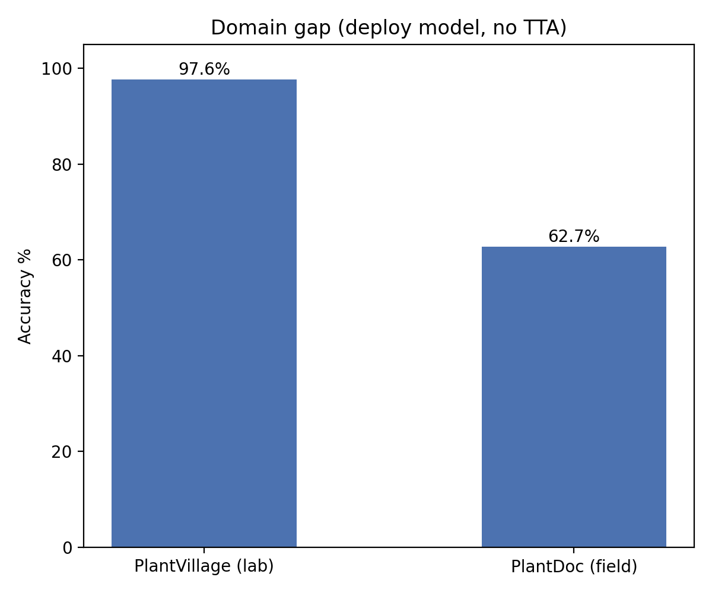
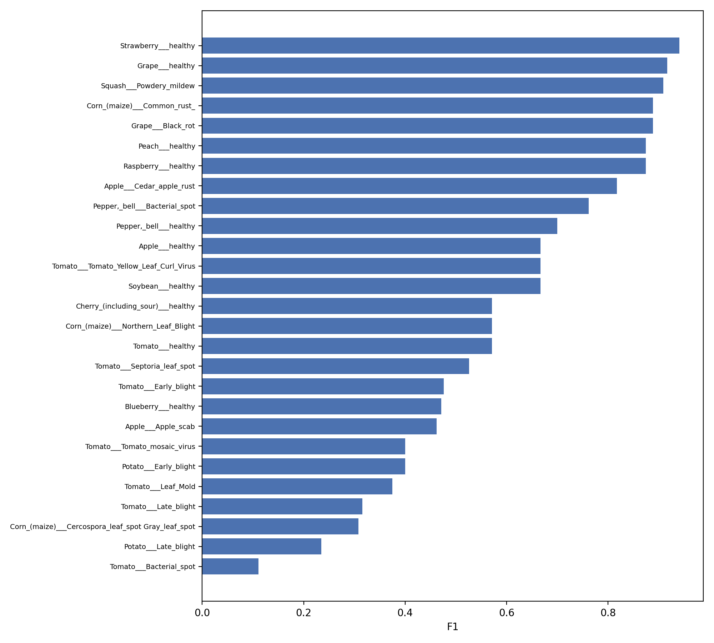
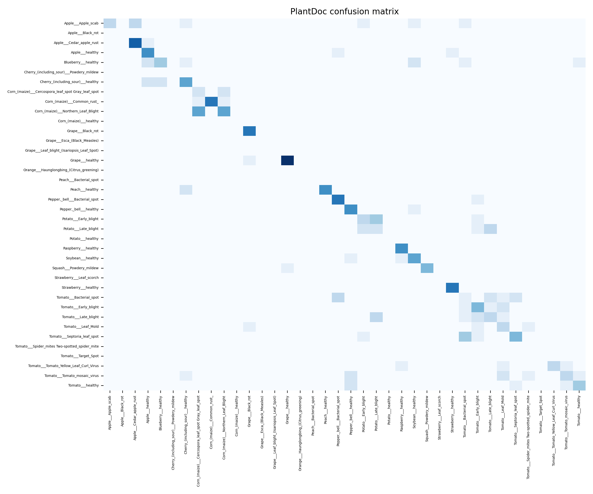

# Model B — Results

**Backbone:** EfficientNetV2-B0 · **Input:** 256×256 · **Classes:** 38  
**Training data:** 80,295 lab + 16,219 field images  

---

## Domain gap

Lab accuracy is high (97.6%) but field accuracy is the real test — real-world photos with messy backgrounds, lighting, and angles.

| Benchmark | Accuracy |
|-----------|:--------:|
| PlantVillage (lab) | 97.6% |
| PlantDoc (field) | 62.7% |
| Gap | 34.9 pp |

---

## Overall metrics

| Metric | Score |
|--------|------:|
| PlantDoc field accuracy | **62.7%** |
| PlantDoc field accuracy (with TTA) | 61.0% |
| PlantVillage lab accuracy | 97.6% |
| Macro F1 (27 scorable classes) | 0.623 |
| Weighted F1 | 0.624 |

---

## Per-class F1 on field test

27 out of 38 classes have PlantDoc test images. Sorted best → worst.

| Class | F1 | Support |
|-------|----|--------:|
| Strawberry — healthy | 0.941 | 8 |
| Grape — healthy | 0.917 | 12 |
| Squash — Powdery mildew | 0.909 | 6 |
| Corn — Common rust | 0.889 | 10 |
| Grape — Black rot | 0.889 | 8 |
| Peach — healthy | 0.875 | 9 |
| Raspberry — healthy | 0.875 | 7 |
| Apple — Cedar apple rust | 0.818 | 10 |
| Pepper — Bacterial spot | 0.762 | 9 |
| Pepper — healthy | 0.700 | 8 |
| Apple — healthy | 0.667 | 9 |
| Soybean — healthy | 0.667 | 8 |
| Tomato — Yellow Leaf Curl Virus | 0.667 | 6 |
| Cherry — healthy | 0.571 | 10 |
| Corn — Northern Leaf Blight | 0.571 | 12 |
| Tomato — healthy | 0.571 | 8 |
| Tomato — Septoria leaf spot | 0.526 | 11 |
| Tomato — Early blight | 0.476 | 9 |
| Blueberry — healthy | 0.471 | 11 |
| Apple — Apple scab | 0.462 | 10 |
| Tomato — Mosaic virus | 0.400 | 10 |
| Potato — Early blight | 0.400 | 8 |
| Tomato — Leaf Mold | 0.375 | 6 |
| Tomato — Late blight | 0.316 | 10 |
| Corn — Gray leaf spot | 0.308 | 4 |
| Potato — Late blight | 0.235 | 8 |
| Tomato — Bacterial spot | 0.111 | 9 |

**F1** = harmonic mean of precision and recall (1.0 = perfect).  
**Support** = test images per class. Ranges 4–12, so a single misclassification can swing F1 by 0.05–0.10.

---

## Confusion matrix

Shows where the model confuses classes. Darker = more predictions in that cell. Diagonal = correct.

Main confusion clusters:
- **Tomato diseases** — Bacterial spot, Early blight, Late blight, Leaf Mold, and Septoria get mixed up with each other
- **Potato** — Early blight and Late blight confused with each other and with tomato diseases
- **Apple** — Apple scab sometimes predicted as healthy or Cedar apple rust

---

## Confidence gating

The model outputs a confidence score (0–1). Setting a minimum threshold lets it abstain on uncertain predictions.

| Min confidence | Images answered | Accuracy on those |
|:--------------:|:---------------:|:-----------------:|
| 0.0 (all) | 100% | 62.7% |
| 0.3 | 94.1% | 65.3% |
| 0.5 | 74.6% | 71.0% |
| **0.7** | **55.1%** | **80.8%** |
| 0.9 | 31.8% | 90.7% |

**Production recommendation:** 0.7 threshold — answers 55% of inputs at 81% accuracy. The rest are flagged as uncertain.

---

## Training history

3-phase schedule on Kaggle T4 GPU:

| Phase | Epochs | Steps/epoch | Final train acc | Best val acc | Best val macro F1 |
|-------|:------:|:-----------:|:---------------:|:------------:|:-----------------:|
| Warmup (frozen) | 4 | 500 | 62.5% | 24.6% | 0.179 |
| Finetune (full) | 14 | 1000 | 89.9% | 65.7% | 0.466 |
| Polish (low LR) | 6 | 600 | 96.7% | 65.7% | 0.466 |

Validation is PlantDoc field images — val accuracy plateaus around 65% while training accuracy climbs to 96.7%. The gap reflects the domain shift from lab to field, not overfitting.

---

## Classes without field test data

These 11 classes are supported by the model but have zero PlantDoc test images:

Apple Black rot · Cherry Powdery mildew · Corn healthy · Grape Esca · Grape Leaf blight · Orange HLB · Peach Bacterial spot · Potato healthy · Strawberry Leaf scorch · Tomato Spider mites · Tomato Target Spot

---

## Weakest classes

| Class | F1 | Likely cause |
|-------|---:|-------------|
| Tomato — Bacterial spot | 0.111 | Confused with other tomato foliar diseases |
| Potato — Late blight | 0.235 | Visually similar to Early blight |
| Corn — Gray leaf spot | 0.308 | Only 4 test images + hard to distinguish |
| Tomato — Late blight | 0.316 | Tomato foliar confusion |
| Tomato — Leaf Mold | 0.375 | Tomato foliar confusion |
